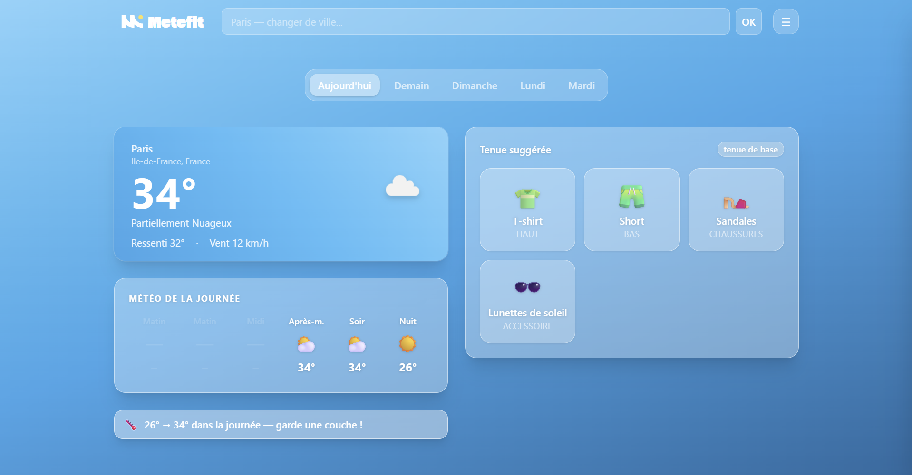
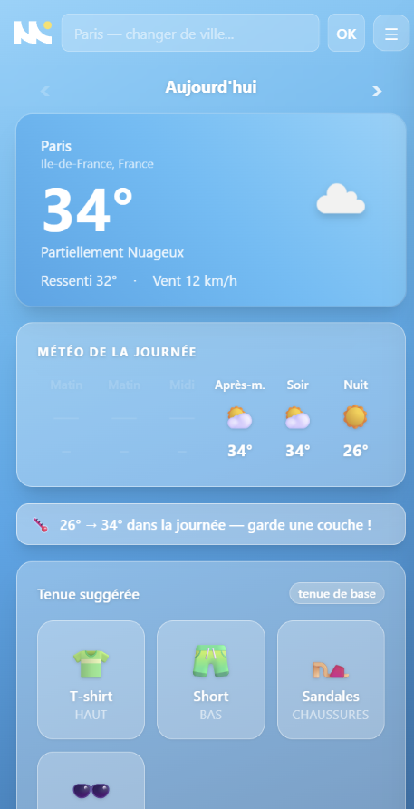

# Météfit

> *Habille-toi intelligemment selon la météo du jour.*

<p align="center">
  
</p>

Météfit est une **Progressive Web App** qui suggère une tenue vestimentaire adaptée à la météo de ta ville, en tenant compte de ton profil thermique personnel.

---

## Aperçu

<p align="center">
  
</p>

<p align="center">
  
</p>

---

## Fonctionnalités

### Météo en temps réel
- Géolocalisation automatique ou recherche manuelle de ville
- Autocomplete avec disambiguation région / pays
- Prévisions sur **5 jours** avec sélecteur de jour (pills sur desktop, flèches sur mobile)
- Timeline heure par heure (Matin · Midi · Après-m. · Soir · Nuit)
- Alertes amplitude thermique et pluie en cours de journée

### Suggestions de tenues
- Grille visuelle de tuiles (emoji · nom · catégorie)
- Suggestion personnalisée basée sur ta garde-robe
- Suggestion générique si la garde-robe est vide
- L'imperméable n'est proposé **que s'il pleut**
- Algorithme de meilleur ajustement : `score = -|temp - centre_plage|`

### Profil thermique
- **Frileux** (−5 °C) · **Normal** · **J'ai chaud** (+5 °C)
- Auto-calibration : analyse les 10 derniers retours et ajuste ±1 °C automatiquement

### Gestion des villes
- Villes **favorites** accessibles en un clic sous la barre de recherche
- Historique des 3 dernières villes recherchées
- Ajout aux favoris depuis les suggestions ou l'historique

### Garde-robe & tenues sauvegardées
- Ajout de vêtements via presets ou formulaire libre
- Sauvegarde d'une tenue sous un nom personnalisé
- Bibliothèque des tenues sauvegardées dans l'onglet Garde-robe

### Notifications
- Notification matinale (6h–11h) avec la tenue du jour à l'ouverture de l'app
- Une seule notification par jour maximum

### Accessibilité
- Structure sémantique complète (`<header>`, `<main>`, `<nav>`, `<article>`)
- ARIA complet : `role="dialog"`, `role="combobox"`, `role="alert"`, `role="switch"`…
- Focus trap dans le panel paramètres + fermeture sur `Escape`
- Lien d'évitement "Aller au contenu principal"
- Emojis décoratifs masqués avec `aria-hidden`
- Annonces dynamiques via `aria-live`

### PWA
- Installable sur mobile et desktop
- Manifest avec icônes et theme color

---

## Stack technique

| Outil | Rôle |
|---|---|
| React 19 | UI |
| TypeScript | Typage |
| Vite | Bundler / Dev server |
| Tailwind CSS v4 | Styles (glassmorphism + dégradé bleu ciel) |
| OpenWeatherMap API | Météo + Geocoding |

Pas de dépendance runtime externe en dehors de React.  
Toutes les données sont persistées en `localStorage`.

---

## Démarrage rapide

```bash
git clone https://github.com/Mano515/metefit.git
cd metefit
npm install
npm run dev        # http://localhost:5173
npm run build      # build de production
npm run preview    # prévisualiser le build
```

---

## Structure du projet

```
src/
├── components/
│   ├── WeatherCard.tsx         # Carte météo (temp, description, icône)
│   ├── DaySelector.tsx         # Pills desktop / flèches mobile
│   ├── DayTimeline.tsx         # Timeline heure par heure
│   ├── DayChangeAlert.tsx      # Alertes amplitude thermique et pluie
│   ├── CitySearch.tsx          # Recherche autocomplete + favoris
│   ├── OutfitSuggestion.tsx    # Grille de tuiles tenue
│   ├── ThermalSelector.tsx     # Choix du profil thermique
│   ├── AddClothingForm.tsx     # Ajout de vêtement (presets + libre)
│   ├── ClothingList.tsx        # Garde-robe
│   ├── SaveOutfitButton.tsx    # Sauvegarde d'une tenue
│   ├── SavedOutfitLibrary.tsx  # Bibliothèque des tenues sauvegardées
│   ├── HistoryList.tsx         # Historique des tenues portées
│   ├── SettingsPanel.tsx       # Drawer paramètres (focus trap)
│   ├── NotificationBanner.tsx  # Activation des notifications
│   ├── ThermalAutoNotice.tsx   # Notice d'auto-calibration
│   └── SplashScreen.tsx        # Écran de chargement initial
│
├── hooks/
│   ├── useWeather.ts           # Météo + geocoding + prévisions 5 jours
│   ├── useWardrobe.ts          # Garde-robe + algorithme de suggestion
│   ├── useThermal.ts           # Profil thermique + auto-calibration
│   ├── useHistory.ts           # Historique des tenues portées
│   ├── useSavedOutfits.ts      # Tenues sauvegardées
│   ├── useCityMemory.ts        # Favoris + villes récentes
│   ├── useNotifications.ts     # Notifications push
│   └── useSwipe.ts             # Détection swipe gauche/droite
│
├── utils/
│   ├── weatherGradient.ts      # Thème de couleur unique (BRAND_BG / BRAND_CARD)
│   ├── defaultSuggestions.ts   # Suggestions génériques par conditions météo
│   └── clothingEmoji.ts        # Emoji associé à chaque vêtement
│
├── types.ts                    # Types TypeScript centraux
├── App.tsx                     # Composant racine
└── index.css                   # Tailwind + animations de transition

public/
├── manifest.json               # PWA manifest
├── logo_metefit.svg            # Icône seule
└── logo_metefit_nom.svg        # Icône + nom
```

---

## Configuration API

L'app utilise l'[API OpenWeatherMap](https://openweathermap.org/api) (gratuite jusqu'à 60 req/min).

La clé API est définie dans `src/hooks/useWeather.ts` et `src/components/CitySearch.tsx`.  
Pour utiliser ta propre clé, remplace la constante `API_KEY` dans ces deux fichiers.

---

## Roadmap

- [ ] Déploiement (Vercel / Netlify)
- [ ] Partage de tenue (lien ou image)
- [ ] Support multi-langue

---

## Licence

Projet personnel — tous droits réservés.
